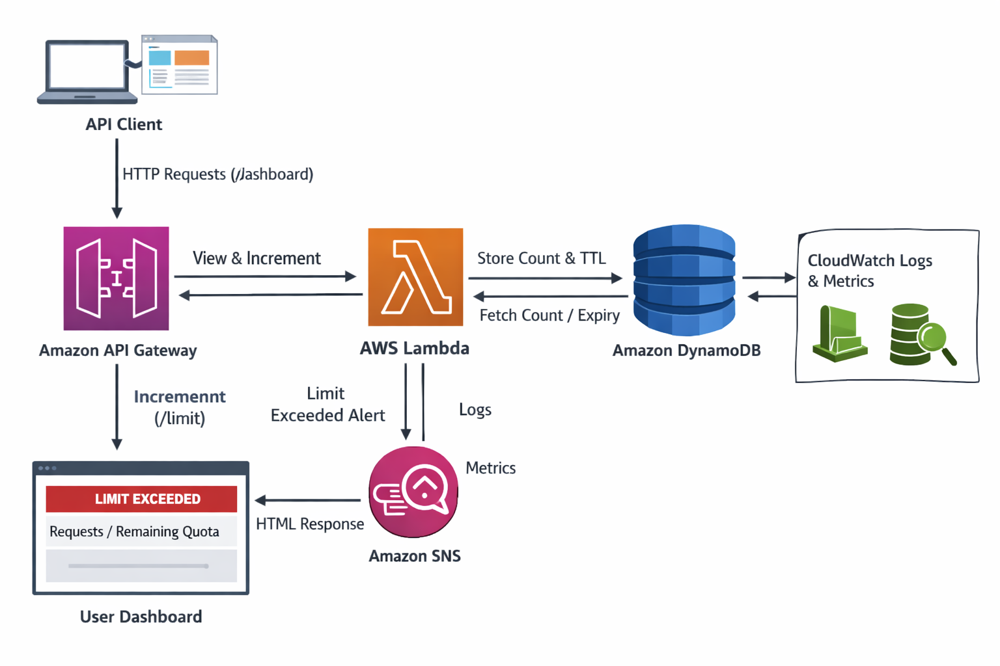

# Serverless Rate Limiting System on AWS

A scalable serverless rate limiting system built using AWS services to control API request quotas per user. The system tracks API usage in real-time, prevents abuse, and automatically resets limits using DynamoDB TTL.

This architecture leverages **API Gateway, AWS Lambda, DynamoDB, SNS, and CloudWatch** to create a fully managed and scalable rate-limiting solution without maintaining servers.


## Architecture

The system follows a serverless architecture where API requests are processed through API Gateway and validated using AWS Lambda. DynamoDB stores request counters with TTL for automatic reset, while SNS and CloudWatch handle alerts and monitoring.



## Key Features

* Serverless architecture with zero infrastructure management
* Real-time API request tracking
* Configurable request limits per user
* Automatic counter reset using DynamoDB TTL
* Alerting system for rate limit violations
* Monitoring using CloudWatch logs and metrics
* Scalable and cost-efficient design


## AWS Services Used

| Service     | Purpose                                    |
| ----------- | ------------------------------------------ |
| API Gateway | Entry point for client API requests        |
| AWS Lambda  | Implements rate limiting logic             |
| DynamoDB    | Stores request counters and TTL            |
| Amazon SNS  | Sends alerts when rate limits are exceeded |
| CloudWatch  | Logs and monitoring                        |


## Request Flow

1. A client sends an HTTP request to the API endpoint.
2. API Gateway receives the request and forwards it to AWS Lambda.
3. Lambda checks the user's request count in DynamoDB.
4. If the request count is below the limit:

   * The counter is incremented.
   * The request is allowed.
5. If the limit is e## DynamoDB Table Schema

| Attribute     | Type   | Description                               |
| ------------- | ------ | ----------------------------------------- |
| client_id     | String | Unique identifier for the API user        |
| request_count | Number | Number of requests made                   |
| ttl           | Number | Expiration timestamp for rate limit reset |

TTL automatically deletes the record after the time window expires, resetting the rate limit.
xceeded:

   * The request is blocked.
   * An alert is sent through SNS.
6. CloudWatch logs all execution events and metrics for monitoring.


## Rate Limiting Logic

The system follows a **fixed window rate limiting strategy**.

Example configuration:

* Request limit: 5 requests
* Time window: 1 minute

Algorithm:

1. Receive API request
2. Check DynamoDB for existing user record
3. If record exists:

   * Increment request counter
4. If record does not exist:

   * Create new record with request_count = 1
5. If request_count > limit:

   * Block request
   * Send SNS alert
6. DynamoDB TTL resets the counter automatically


## Project Structure

```
serverless-rate-limiter
│
├── lambda
│   ├── rate_limiter.py
│
├── infrastructure
│   ├── api_gateway_config.json
│
├── architecture.png
├── README.md
```


## Example Responses

### Request Allowed

```
{
  "status": "success",
  "message": "Request allowed",
  "remaining_requests": 3
}
```

### Limit Exceeded

```
{
  "status": "error",
  "message": "Rate limit exceeded"
}
```


## Why This Project Matters

This project demonstrates:

* Practical cloud architecture design
* Serverless application development
* API protection techniques
* Scalable system design using managed AWS services
* Monitoring and alerting integration

It simulates how production systems enforce API quotas and prevent abuse.
